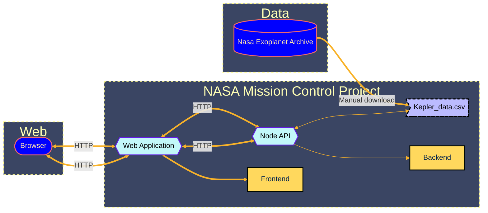

# Nasa-project
Nasa Mission control for finding inhabitable planets using data and inference taken from:

- [a-review-of-the-best-habitable-planet-candidates](https://www.centauri-dreams.org/2015/01/30/a-review-of-the-best-habitable-planet-candidates/)

- [habitable-exoplanets-catalog](https://phl.upr.edu/projects/habitable-exoplanets-catalog)

## Architecture Diagram of the Project

